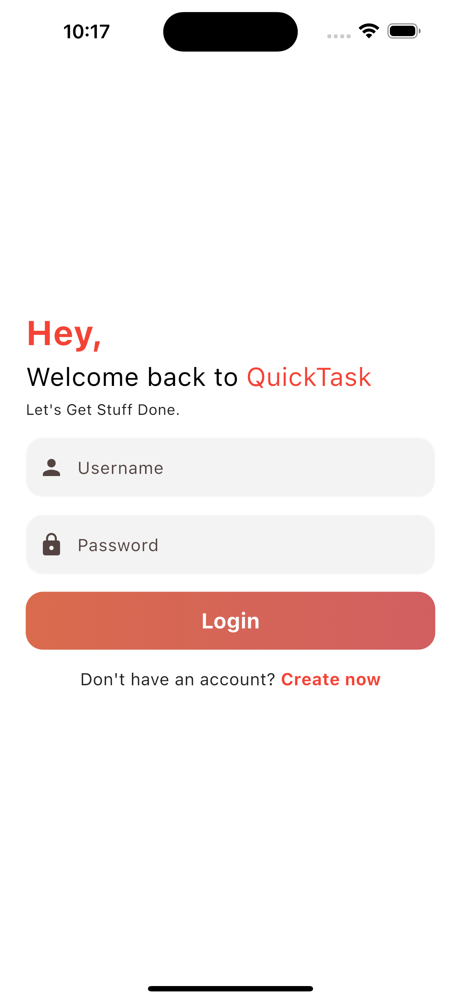
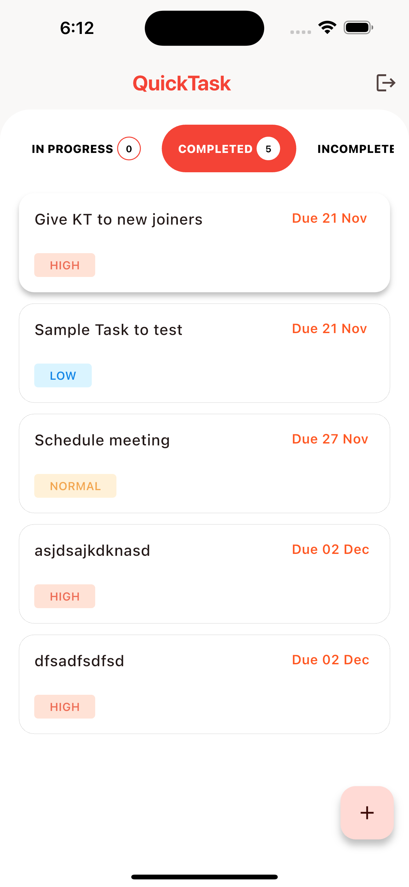
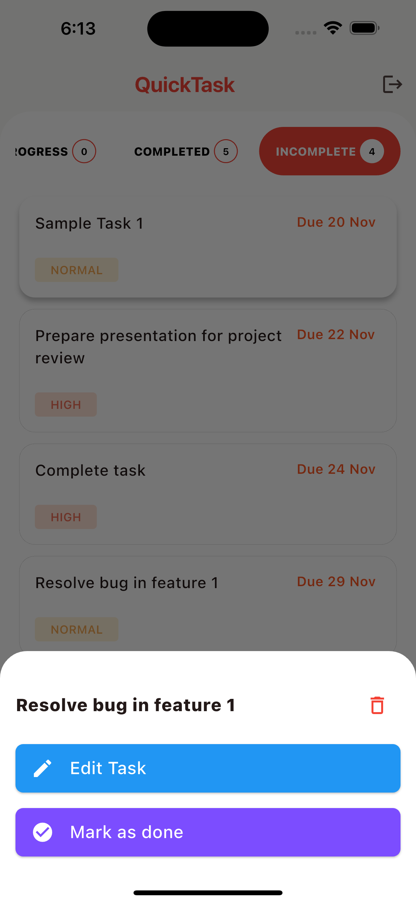

# 📋 QuickTask

**QuickTask** is a Flutter-based task management app that uses the **BLoC pattern** for state management and integrates with **Back4App** for cloud storage and real-time updates. It supports task creation, updates, and deletion, along with offline data persistence using **Shared Preferences**.

---

## 🚀 Features
- **Task Management**: Add, update, and delete tasks.
- **Real-Time Sync**: Seamlessly sync tasks with **Back4App**.
- **Offline Support**: Persist data locally using **Shared Preferences**.
- **Widgets Used**:
  - `ListView` for displaying tasks.
  - `TextFormField` for input and validation.
  - `RefreshIndicator` for pull-to-refresh.
  - `StreamBuilder` for live data updates.
  - `ElevatedButton`, `Container`, `Scaffold`, and more.

---

## 🛠️ Tech Stack
- **Flutter**  
- **BLoC Pattern**  
- **Back4App (Parse Server)**  
- **Shared Preferences**  
- **Streams**  

---

## 🌐 Back4App Integration  

QuickTask utilizes **Back4App** as its backend for the following:  

- **Task Data Management**: Handle CRUD operations for tasks.  
- **Cloud Database**: Store user data securely and access it in real time.  
- **API Hooks**: Simplified interactions using REST APIs provided by Back4App.  
- **Scalability**: Automatically scale storage and bandwidth as the app grows.  

### Setting Up Back4App  

1. Create an account on [Back4App](https://www.back4app.com).  
2. Set up a Parse Server and obtain your App ID and Client Key.  
3. Update the credentials in the app configuration:  
   ```dart  
   const String appId = "Your_App_ID";  
   const String clientKey = "Your_Client_Key";  
   const String serverUrl = "https://Your_Back4App_Instance_URL";

---

## 🧩 Setup Instructions
1. Clone the repository:
   ```bash
    git clone https://github.com/sushanthrdy/QuickTask.git
   cd QuickTask
2. Install dependencies:
   ```bash
   flutter pub get
3. Run the app:
   ```bash
   flutter run

---

## 🧩 Project Structure
```bash
  QuickTask/  
  ├── lib/  
  │   ├── bloc/           # BLoC classes  
  │   ├── model/          # Data models
  │   ├── network/          # API classes
  │   ├── pages/         # UI screens  
  │   ├── repository/        # Repository classes
  │   ├── utils/           # Helper utilities  
  │   └── widgets/         # Reusable UI components  
  └── pubspec.yaml         # Project dependencies
  ```
---

## 📸 App Demo

[](https://www.youtube.com/watch?v=uTW7CMKl1AE)

---

## 📸 Screenshots  

<div>







</div>
 

---

## 🤝 Contributing  

Contributions are welcome! Please fork the repository and create a pull request.  
To submit a pull request, follow these steps:

1. Fork the repository.
2. Create a new branch (`git checkout -b feature-name`).
3. Commit your changes (`git commit -am 'Add feature'`).
4. Push to the branch (`git push origin feature-name`).
5. Create a new pull request.

---

## 📜 License  

This project is licensed under the [Apache License 2.0](LICENSE).  
